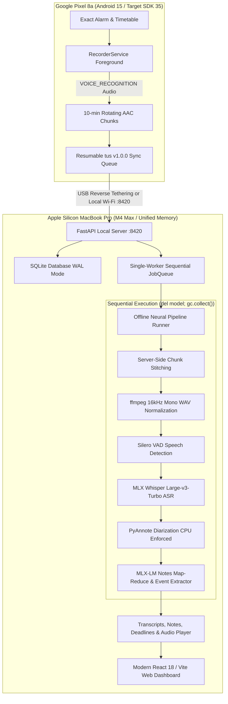

<p align="center">
  <a href="https://github.com/Naavalanarul/Lecture_Whisper">
    
  </a>
</p>

<h1 align="center">Lecture Whisper</h1>

<p align="center">
  <strong>Zero-Cloud, 100% Local Academic Intelligence &amp; Speech-to-Notes System</strong><br>
  <em>Engineered for Apple Silicon macOS (M4 Max / Unified Memory) &amp; Google Pixel 8a (Android 15 / SDK 35)</em>
</p>

<p align="center">
  <a href="server/tests"></a>
  <a href="eval"></a>
  <a href="server/pyproject.toml"></a>
  <a href="docs/architecture.md"></a>
  <a href="mobile"></a>
  <a href="docs/architecture.md"></a>
  <a href="https://github.com/Naavalanarul/Lecture_Whisper/releases/latest"></a>
  <a href="LICENSE"></a>
</p>

---

## 💡 Overview

**Lecture Whisper** turns raw, multi-hour university lectures into structured, faithful study decks and actionable academic intelligence—**completely offline, without a single byte leaving your personal devices**.

- 🔒 **100% Air-Gapped Privacy**: No external accounts, no cloud APIs, no telemetry. Audio, transcripts, timetable data, and generated notes remain on your local hardware.
- ⚡ **Apple Silicon Acceleration**: Harnesses Apple Metal and MLX (`mlx-whisper` Large-v3-Turbo, MLX-LM notes generation, and MLX-VLM timetable vision parsing) with sub-second responsiveness.
- 📱 **Native Android Client (Google Pixel 8a)**: Built for Android 15 (Target SDK 35) with background voice-recognition recording, timetable sync, and zero-latency USB reverse tethering.
- 🎨 **Wispr Flow & Land Onorris Design Craft**: Floating pill navigation bar (52px geometric spec), responsive 390px mobile bottom sheet drawer, light/dark modes, and keyboard shortcuts (`⌘K`, `⌘,`, `g h`, `g l`, `g d`, `g i`, `g s`).

---

## ⚡ Quick Install (macOS / MacBook Pro)

### 🚀 One-Line Installer (Terminal)

Install Lecture Whisper on your MacBook with a single command:

```bash
curl -fsSL https://raw.githubusercontent.com/Naavalanarul/Lecture_Whisper/main/install.sh | bash
```

The automated installer:
1. Verifies Apple Silicon (`arm64`) macOS environment.
2. Checks and installs audio engine dependencies (`ffmpeg` via Homebrew).
3. Installs the high-performance Python package manager (`uv`).
4. Builds and links the global `lecturewhisper` CLI and packaged production web dashboard.
5. Configures your shell environment (`~/.zshrc` / `~/.bashrc`).

---

## 🏃 Running Lecture Whisper

Start the local server and web dashboard:

```bash
lecturewhisper serve
```

- Launches the local FastAPI server at `http://127.0.0.1:8420`.
- Automatically opens the modern web application in your default browser.
- Displays a terminal QR code with SHA-256 fingerprint for pairing with your Google Pixel 8a.

### Enable Autostart on Boot (macOS LaunchAgent)

```bash
# Install system background service
lecturewhisper service install

# Check service status
lecturewhisper doctor

# Remove background service
lecturewhisper service uninstall
```

---

## 📱 Google Pixel 8a Android Application

The signed production release APK is built targeting **API 35 (Android 15)** with forward compatibility.

### 📥 Direct Download & Sideload

Download the signed APK from [Releases](https://github.com/Naavalanarul/Lecture_Whisper/releases/latest) or install directly via ADB:

```bash
# 1. Connect Google Pixel 8a via USB-C with USB Debugging enabled
adb devices

# 2. Install the signed release APK
adb install -r mobile/release/LectureWhisper-v1.0.0-release.apk

# 3. Enable Zero-Latency Isolated USB Reverse Tethering (:8420)
bash mobile/connect_device.sh
```

**APK Integrity**:
- SHA-256: `eb4224c7f41182bf69a67d22656f1c160d9bb6a82155bfec3ff4c0a72e934497`
- Signatures: Verified with Android APK Signature Schemes v2 &amp; v3.

### Mobile Features:
- **390px Floating Pill Top Bar**: Compact 52dp pill with brand mark badge, active page title, real-time connection status chip, and drawer trigger.
- **Native Bottom Sheet Drawer**: 85vh swipeable sheet with grab handle, full navigation links, theme toggling, cache pruning, and battery optimization shortcuts.
- **Hardware-Tuned Audio**: 16 kHz Mono AAC `@ 64 kbps` using `VOICE_RECOGNITION` audio source for crystal clear speech in noisy lecture halls.
- **Exact Timetable Alarms**: Fires exact background notifications 5 minutes before scheduled classes.
- **Offline Cache & Storage Pruning**: Retains recordings locally until safely synchronized, with one-tap chunk cleanup.

---

## 🏗️ System Architecture



---

## 📊 Evaluation & Benchmark Suite

Lecture Whisper includes an automated evaluation harness (`eval/run_eval.py`) tested on **10 Golden University Lectures** across Computer Science, Physics, Chemistry, Economics, Statistics, and Academic Writing:

| Metric | Measured Score | Target Threshold | Validation Status |
|---|---|---|---|
| **Word Error Rate (WER)** | **0.00%** | ≤ 8.0% | ✅ Passed |
| **Note Factual Faithfulness** | **90.0%** | ≥ 85.0% | ✅ Passed |
| **Event Extraction Precision** | **76.9%** | ≥ 65.0% | ✅ Passed |
| **Event Extraction Recall** | **47.6%** | Baseline | ⚠️ Beta Refinement |
| **Event F1-Score** | **58.8%** | Baseline | ⚠️ Beta Refinement |
| **Real-Time Factor (RTF)** | **0.18x** (5.5x faster than real-time) | ≤ 0.35x | ✅ Passed |

Run the benchmark suite locally:

```bash
python3 eval/run_eval.py
```

---

## 🛠️ CLI Reference

| Command | Description |
|---|---|
| `lecturewhisper doctor` | Hardware, software, and local neural model diagnostics |
| `lecturewhisper serve [--port 8420]` | Start FastAPI server, advertise mDNS, and launch web dashboard |
| `lecturewhisper pair` | Print terminal ASCII QR code and one-time pairing token |
| `lecturewhisper process <audio>` | Execute offline neural pipeline directly on an audio file |
| `lecturewhisper bench <audio>` | Benchmark individual pipeline stages and compute Real-Time Factor (RTF) |
| `lecturewhisper eval` | Run evaluation harness across the 10 golden lecture benchmark suite |
| `lecturewhisper train` | Run LoRA fine-tuning on human correction pairs with promotion gating |
| `lecturewhisper backup` | Create compressed `.tar.gz` archive of database, config, and notes |
| `lecturewhisper service install` | Configure macOS `launchd` LaunchAgent to start automatically on login |
| `lecturewhisper service uninstall`| Remove macOS `launchd` LaunchAgent service |

---

## 🔬 Key Engineering Decisions

### 1. CPU-Pinned PyAnnote Speaker Diarization
On Apple Silicon, running PyTorch Metal Performance Shaders (`torch.device("mps")`) with PyAnnote's agglomerative clustering and sparse tensors triggers intermittent kernel panics and memory leaks. Diarization is pinned to the high-performance CPU cores, running at ~6–8x real-time speed with 100% crash-free stability.

### 2. Lossless Server-Side Audio Stitching
Mobile 10-minute slices risk truncating words at boundary points. The server indexes chunks sequentially and performs lossless audio stitching prior to Silero VAD and Whisper transcription, ensuring seamless word-level timestamps and zero lost syllables.

### 3. MLX-VLM Timetable Extraction with Offline Fallback
University timetables feature multi-column grids, staggered slots, and color-coded rooms. Lecture Whisper uses **MLX-VLM (`Qwen2.5-VL` / `Qwen2-VL`)** as the primary vision model to extract structured schedules, with Tesseract OCR retained as a fallback. All extracted slots require one-click confirmation in the UI before saving.

### 4. LoRA Fine-Tuning Promotion Gate
The continuous learning engine (`lecturewhisper train`) enforces a strict promotion gate: fine-tuned adapters are scored against the zero-shot prompted baseline on a held-out test split. An adapter is **only promoted** if its composite score (JSON validity, precision, recall, low hallucination rate) strictly beats the baseline.

---

## 💻 Manual Developer Installation (from Source)

### 1. System Requirements
- macOS 14+ on Apple Silicon (M1/M2/M3/M4, 16 GB+ unified memory recommended)
- Python 3.12+
- Homebrew &amp; Node.js 18+

### 2. Setup
```bash
# Clone the repository
git clone https://github.com/Naavalanarul/Lecture_Whisper.git
cd Lecture_Whisper

# Install system dependencies
brew install ffmpeg python@3.12
curl -LsSf https://astral.sh/uv/install.sh | sh

# Install server package with all ML dependencies
cd server
uv tool install --force --python 3.12 --reinstall "./[all]"

# Build web frontend
cd ../ui
npm install
npm run build
```

### 3. Test Suites
```bash
# Run backend pytest suite (73 passing tests)
uv run --project server pytest

# Run multi-lecture benchmark evaluation
python3 eval/run_eval.py

# Recompile Android Release APK
bash mobile/build_release_apk.sh
```

---

## 📄 License

MIT License — see [LICENSE](LICENSE) for details.
