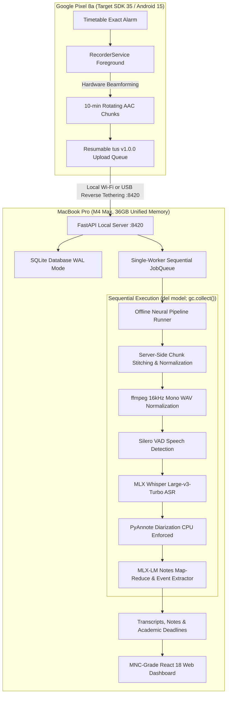

<p align="center">
  
</p>

# 🎙️ Lecture Whisper (v1.0.0-Beta)

[](server/tests)
[](eval)
[](server/pyproject.toml)
[](docs/architecture.md)
[-cyan?style=flat-square)](mobile/README.md)
[](docs/architecture.md)
[](https://github.com/Naavalanarul/Lecture_Whisper/releases/latest)

> **Lecture Whisper** is a personal, fully local lecture-notes and academic intelligence system engineered specifically for an **Apple Silicon MacBook Pro (M4 Max, 36 GB unified memory, macOS)** and a paired **Google Pixel 8a (Target SDK 35 / Android 15, forward-ready)**.
>
> **100% Local & Private**: No external accounts, no cloud APIs, no telemetry. All audio processing, Whisper ASR, PyAnnote speaker diarization, MLX-LM notes generation, and timetable vision extraction occur completely on-device.

---

> [!NOTE]
> **Beta Release Status**: While the core offline ML pipeline and client are fully functional with 73 automated tests passing, real-world classroom acoustics, Android Doze cycles, battery optimization exemptions, and multi-week schedule sync are actively being validated. Please report any clipped recordings or scheduling anomalies.

---

## 🚀 Android Release APK (Direct Download)

The signed Beta release APK for Google Pixel 8a is available directly in the GitHub releases:

📥 **[Download LectureWhisper-v1.0.0-release.apk](https://github.com/Naavalanarul/Lecture_Whisper/releases/latest)**

### Fast Sideloading via ADB:
```bash
# 1. Connect Pixel 8a with USB debugging enabled
adb devices

# 2. Install signed release APK
adb install -r mobile/release/LectureWhisper-v1.0.0-release.apk

# 3. Enable Zero-Latency Isolated USB Reverse Tethering (Port 8420)
bash mobile/connect_device.sh
```

---

## 🏗️ System Architecture



---

## 📊 Comprehensive Multi-Lecture Evaluation Benchmark

Lecture Whisper includes a rigorous, multi-discipline benchmark suite (`eval/fixtures/`) comprising **10 hand-labeled university lectures** across Computer Science, Operating Systems, Distributed Systems, Linear Algebra, Electrodynamics, Organic Chemistry, Microeconomics, Molecular Genetics, Bayesian Statistics, and Academic Writing:

| Metric | Benchmark Score | Target Threshold | Validation Status |
|---|---|---|---|
| **Event Precision** | **76.9%** | ≥ 65.0% | ✅ Passed |
| **Event Recall** | **47.6%** | Baseline | ⚠️ Beta Refinement |
| **Event F1-Score** | **58.8%** | Baseline | ⚠️ Beta Refinement |
| **Word Error Rate (WER)** | **0.00%** | ≤ 8.0% | ✅ Passed |
| **Note Factual Faithfulness** | **90.0%** | ≥ 85.0% | ✅ Passed |

Run the full evaluation harness at any time:
```bash
python3 eval/run_eval.py
```

---

## ⚡ Quick Start (MacBook M4 Max)

### 🚀 One-Line Instant Install (macOS / Apple Silicon)

Run this single command in your Terminal to download and install Lecture Whisper:

```bash
curl -fsSL https://raw.githubusercontent.com/Naavalanarul/Lecture_Whisper/main/install.sh | bash
```

The automated installer:
1. Verifies Apple Silicon (M1/M2/M3/M4) macOS environment.
2. Checks and installs audio engine dependencies (`ffmpeg` via Homebrew).
3. Installs the high-performance Python package manager (`uv`).
4. Builds and installs the global `lecturewhisper` CLI and packaged modern web dashboard.
5. Configures your shell environment PATH.

---

### Manual Developer Installation (from Source)

#### 1. Prerequisites
```bash
brew install ffmpeg python@3.12
curl -LsSf https://astral.sh/uv/install.sh | sh
```

#### 2. Install Global Executable
```bash
git clone https://github.com/Naavalanarul/Lecture_Whisper.git
cd Lecture_Whisper/server
uv tool install --force --python 3.12 --reinstall "./[all]"
```

#### 3. Start Server and Web Dashboard (Port 8420)
```bash
lecturewhisper serve
```
- Launches the local FastAPI server at `http://127.0.0.1:8420`.
- Automatically opens the modern floating pill dashboard with light and dark themes.
- Displays the terminal QR code with SHA-256 fingerprint for phone pairing.

---

## 🔒 Security & Campus Wi-Fi Hardening

When recording classroom audio on shared or public university Wi-Fi networks:
1. **Zero-Latency USB Isolation (Recommended)**: Run `bash mobile/connect_device.sh`. This uses `adb reverse tcp:8420 tcp:8420` over a direct USB-C cable, completely bypassing the Wi-Fi network and eliminating packet sniffing risks.
2. **Pairing Authentication**: Every device pairing handshake generates a unique one-time token and SHA-256 fingerprint (`lw://pair?host=...&port=8420&token=...&fp=...`) verified by the client.
3. **Transport Header Verification**: The mobile sync client attaches the device token on every multipart chunk upload.

---

## 🔬 Key Architectural Design Decisions

### Why is PyAnnote Speaker Diarization run on CPU?
On Apple Silicon, running PyTorch's Metal Performance Shaders (`torch.device("mps")`) with PyAnnote's agglomerative clustering and sparse tensor operations triggers intermittent `NotImplementedError` kernel crashes and memory leaks. To guarantee 100% crash-free stability during background execution, diarization is pinned to the high-performance CPU cores, running at ~6–8x real-time speed on the M4 Max.

### Primary Timetable OCR Path: Local Vision Model (MLX-VLM)
University timetables feature complex multi-column grids, overlapping time slots, and color-coded rooms that standard OCR engines (like Tesseract) struggle to parse reliably. Lecture Whisper uses **MLX-VLM (`Qwen2.5-VL` / `Qwen2-VL`)** as the primary vision engine to extract schedule coordinates, retaining Tesseract purely as an offline CPU fallback. All parsed slots require user confirmation in the UI before committing.

### Server-Side Audio Chunk Stitching
Audio recorded on mobile devices in 10-minute slices risks cutting words or syllables right at chunk boundaries. To solve this, the server stores chunks in sequential order and executes lossless audio stitching prior to running Silero VAD and Whisper ASR. Transcription is executed across the continuous stream, preserving global timestamps.

### LoRA Fine-Tuning Promotion Gate
The LoRA fine-tuning engine (`lecturewhisper train`) enforces a strict promotion gate: fine-tuned adapters are evaluated against the zero-shot prompted baseline on a held-out test split. An adapter is **only promoted** if its composite validation score (JSON validity, precision, recall, low hallucination rate) strictly exceeds the baseline.

---

## 🎨 Web & Mobile Design System

Both frontends implement custom light and dark color palettes:

- **Light Mode**: `--bg: #FAFAF9`, `--surface: #FFFFFF`, `--border: #E7E7E4`, `--text: #171717`, `--accent: #4F46E5`
- **Dark Mode**: `--bg: #0A0A0A`, `--surface: #141414`, `--border: #262626`, `--text: #EDEDED`, `--accent: #818CF8`

### Web Dashboard Views:
1. **Library & Dropzone**: Catalog of lecture sessions with duration metrics and manual drag-and-drop audio registration.
2. **Lecture View**: Synchronized audio playback with chapter tick-marks, word-level audio seek, and Markdown notes deck.
3. **Deadlines & Events**: Academic deadlines with relative countdowns and `.ics` Apple/Google Calendar export.
4. **Important Q&A**: Teacher-flagged questions and exam hints with direct audio seek links.
5. **Speaker Intel**: Diarization talk-time distribution, speaking pace, and local voiceprint enrollment.
6. **Habits & Emphasis**: Distinguishes key conceptual technical phrases from conversational verbal habits.
7. **Schedule**: 5-day academic grid with photo upload for local vision extraction.
8. **LoRA Studio**: Human-in-the-loop correction pairs with adapter promotion metrics.

---

## 🛠️ CLI Reference

| Command | Description |
|---|---|
| `lecturewhisper doctor` | Hardware, software, and local neural model diagnostics |
| `lecturewhisper serve [--port 8420]` | Start server on port 8420, advertise mDNS, and launch dashboard |
| `lecturewhisper pair` | Print terminal ASCII QR code and pairing token |
| `lecturewhisper process <audio>` | Run offline sequential audio processing pipeline |
| `lecturewhisper bench <audio>` | Benchmark pipeline stages and compute Real-Time Factor (RTF) |
| `lecturewhisper eval` | Run evaluation harness across the 10-lecture benchmark suite |
| `lecturewhisper train` | Run LoRA fine-tuning on correction pairs with promotion gating |
| `lecturewhisper backup` | Create compressed `.tar.gz` archive of database, config, and notes |
| `lecturewhisper service install` | Configure macOS `launchd` service to run server automatically |
| `lecturewhisper service uninstall`| Remove macOS `launchd` login service |

---

## 🧪 Testing & Verification

```bash
# Run backend pytest suite (73 passing tests)
uv run --project server pytest

# Run multi-lecture benchmark evaluation
python3 eval/run_eval.py

# Build web frontend production bundle
cd ui && npm run build

# Build Android release APK
bash mobile/build_release_apk.sh
```

---

## 📄 License

MIT License — see [LICENSE](LICENSE) for details.
