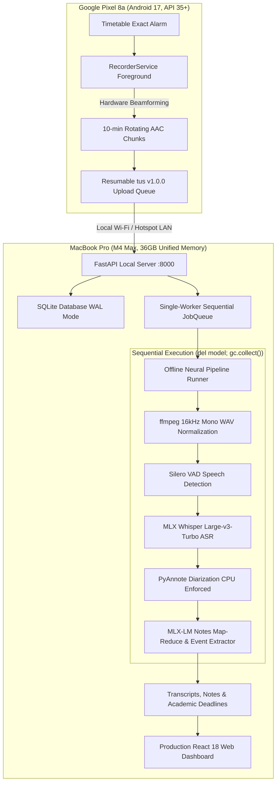

# 🎙️ Lecture Whisper

[](server/tests)
[](server/pyproject.toml)
[](docs/architecture.md)
[-cyan?style=flat-square)](mobile/README.md)
[](docs/architecture.md)
[](https://github.com/Naavalanarul/Lecture_Whisper/releases/latest)

> **Lecture Whisper** is a personal, fully local lecture-notes and academic intelligence system engineered specifically for an **Apple Silicon MacBook Pro (M4 Max, 36 GB unified memory, macOS)** and a paired **Google Pixel 8a (Android 17, API 35+)**.
>
> **Zero cloud footprint**: No external accounts, no cloud APIs, no Play Store dependencies, no third-party telemetry. All audio, speech-to-text transcription, speaker diarization, and notes generation occur entirely on-device over local Wi-Fi.

---

## 🚀 Android Release APK (Direct Download)

The signed production release APK for Google Pixel 8a is available directly in the releases section:

📥 **[Download LectureWhisper-v1.0.0-release.apk](https://github.com/Naavalanarul/Lecture_Whisper/releases/latest)**

### Fast Sideloading via ADB:
```bash
# Connect Pixel 8a with USB debugging enabled
adb devices

# Install signed release APK
adb install -r mobile/release/LectureWhisper-v1.0.0-release.apk
```

---

## 🏗️ System Architecture



---

## ⚡ Quick Start (MacBook M4 Max)

### 1. Prerequisites
Ensure Homebrew, Python 3.12, and `uv` are installed:
```bash
brew install ffmpeg python@3.12
curl -LsSf https://astral.sh/uv/install.sh | sh
```

### 2. Clone & Install Global Tool
```bash
git clone https://github.com/Naavalanarul/Lecture_Whisper.git
cd Lecture_Whisper/server

# Install local package and global executable with MLX support
uv tool install --force --python 3.12 --with mlx --reinstall .
```

### 3. Run System Diagnostics
```bash
lecturewhisper doctor
```
Verifies Apple Silicon arm64, macOS version, Python 3.12, ffmpeg, MLX GPU availability, disk space, and data directory (`~/.lecturewhisper`).

### 4. Start Server and Web Dashboard
```bash
lecturewhisper serve
```
- Launches the local FastAPI server at `http://localhost:8000`.
- Serves the production-bundled React + Vite + Tailwind dashboard.
- Advertises Bonjour mDNS service `_lecturewhisper._tcp` on your local network.
- Displays the terminal QR code for instant Pixel 8a pairing.
- Automatically opens your default browser.

---

## 🎨 Production Web Dashboard

The web dashboard is built to production standards (Linear / Vercel design aesthetics) with 8 dedicated views:

1. **Library & Dropzone**: Lecture catalog, duration metrics, and drag-and-drop audio file upload for manual processing.
2. **Lecture Deep-Dive**: Synchronized audio scrubber with chapter tick-marks, word-level audio seek, and Markdown-styled notes deck.
3. **Deadlines & Academic Events**: Relative countdowns ("due Friday", "exam in 3 days"), inline confirmation, and one-click `.ics` calendar download for Apple/Google Calendar.
4. **Important Questions**: Exam hints and teacher-flagged inquiries with direct audio jump links.
5. **Speaker Intelligence**: Diarization talk-time distribution bar, speaking pace (WPM), and local voiceprint registration.
6. **Habits & Emphasis**: Separates key conceptual technical terms from conversational verbal mannerisms.
7. **Schedule / Timetable**: Interactive 5-day schedule grid with timetable photo upload for local MLX-VLM schedule extraction.
8. **LoRA Fine-Tuning Studio**: Human-in-the-loop correction pairs with visual diffs and interactive local fine-tuning runner.

### Global Keyboard Navigation:
- `Space`: Toggle Play / Pause audio
- `J` / `←`: Rewind 10 seconds
- `L` / `→`: Forward 10 seconds
- `M`: Mute / Unmute
- `1` – `8`: Quick switch between views
- `?`: Open keyboard shortcuts cheat sheet
- `Esc`: Close open modals

---

## 📱 Mobile Architecture (Google Pixel 8a, Android 17)

- **Microphone Foreground Service**: Uses `foregroundServiceType="microphone"` and `VOICE_RECOGNITION` audio source to capture clear lecture audio with hardware beamforming.
- **Rotating Chunks**: Writes 10-minute `.m4a` files with partial wake lock (`PARTIAL_WAKE_LOCK`). Reboots or low battery will at most lose <10 minutes of audio.
- **Resumable Uploads**: Uploads over local Wi-Fi using the `tus` v1.0.0 protocol with SHA-256 verification and automatic retry.
- **Automated Scheduling**: Exact alarm notifications (`SCHEDULE_EXACT_ALARM`) triggered right before class start.

---

## 🛠️ CLI Reference

| Command | Description |
|---|---|
| `lecturewhisper doctor` | Run full hardware, software, and local model diagnostic checks |
| `lecturewhisper serve` | Start API server, Bonjour mDNS, and launch web dashboard |
| `lecturewhisper pair` | Print terminal ASCII QR code and one-time pairing token |
| `lecturewhisper process <audio>` | Run offline audio pipeline on an audio file |
| `lecturewhisper bench <audio>` | Benchmark stages (VAD, ASR, Diarization) and compute Real-Time Factor (RTF) |
| `lecturewhisper eval` | Run evaluation harness on golden fixtures and output precision/recall |
| `lecturewhisper train` | Run LoRA fine-tuning on human correction pairs |
| `lecturewhisper backup --dest <dir>` | Create a compressed `.tar.gz` archive of database, config, and notes |
| `lecturewhisper service install` | Configure macOS `launchd` to automatically run server at login |
| `lecturewhisper service uninstall`| Remove macOS `launchd` login service |

---

## 🧪 Testing & Verification

```bash
# Run backend pytest suite (69 tests)
uv run --project server pytest

# Build frontend production bundle
cd ui && npm run build
```

---

## 📄 License

MIT License — see [LICENSE](LICENSE) for details.
