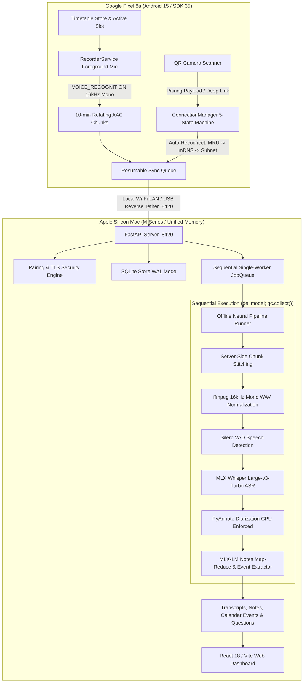

<p align="center">
  <a href="https://github.com/Naavalanarul/Lecture_Whisper">
    
  </a>
</p>

<h1 align="center">Lecture Whisper</h1>

<p align="center">
  <strong>Zero-Cloud, 100% Local Academic Intelligence &amp; Speech-to-Notes System</strong><br>
  <em>Engineered for Apple Silicon macOS (M-Series / Unified Memory) &amp; Google Pixel 8a (Android 15 / SDK 35)</em>
</p>

<p align="center">
  <a href="server/tests"></a>
  <a href="eval"></a>
  <a href="server/pyproject.toml"></a>
  <a href="docs/architecture.md"></a>
  <a href="mobile"></a>
  <a href="docs/architecture.md"></a>
  <a href="https://github.com/Naavalanarul/Lecture_Whisper/releases/latest"></a>
  <a href="LICENSE"></a>
</p>

---

## 📑 Table of Contents

- [Overview](#-overview)
- [Quick Install (macOS / MacBook)](#-quick-install-macos--macbook)
- [Running Lecture Whisper](#-running-lecture-whisper)
- [Google Pixel 8a Android App (Mobile v2)](#-google-pixel-8a-android-app-mobile-v2)
- [Web Dashboard & UI Craft](#-web-dashboard--ui-craft)
- [System Architecture](#-system-architecture)
- [Real-Recording Benchmark Suite](#-real-recording-benchmark-suite)
- [CLI Reference](#-cli-reference)
- [Security & Privacy Blueprint](#-security--privacy-blueprint)
- [Manual Installation from Source](#-manual-installation-from-source)
- [License](#-license)

---

## 💡 Overview

**Lecture Whisper** converts multi-hour university lectures into structured, faithful study decks, synchronized verbatim transcripts, and actionable academic intelligence—**completely offline, without a single byte leaving your personal hardware**.

- 🔒 **100% Air-Gapped Privacy**: Zero cloud APIs, zero external telemetry, zero tracking. All raw audio, transcripts, schedule data, and AI-generated notes stay on your local disk.
- ⚡ **Apple Silicon Acceleration**: Fully optimized for Apple Metal and MLX (`mlx-whisper` Large-v3-Turbo, MLX-LM notes extraction, and MLX-VLM timetable OCR) with sub-second responsiveness.
- 📱 **Native Android Client v2 (Google Pixel 8a)**: Built for Android 15 (Target SDK 35) with an Instagram-grade 5-tab shell, native 7-band real-time audio visualizer, cryptographic QR camera pairing, and automatic background reconnection.
- 🎨 **Wispr Flow & Linear Editorial Craft**: Dark obsidian (`#070A12`) and clean paper (`#FAFAF9`) surfaces, strict 2-hue discipline (Brand Indigo `#6366F1` and Alert `#EF4444`), WCAG AA compliant contrast, floating link pill navigation, and rich keyboard navigation (`⌘K`, `Space`, `J`, `L`, `?`).

---

## ⚡ Quick Install (macOS / MacBook)

### 🚀 One-Line Installer (Terminal)

Install Lecture Whisper on your MacBook with a single command:

```bash
curl -fsSL https://raw.githubusercontent.com/Naavalanarul/Lecture_Whisper/main/install.sh | bash
```

The automated installer performs:
1. **Hardware Verification**: Checks for Apple Silicon (`arm64`) macOS environment.
2. **Audio Engine Dependencies**: Installs and verifies `ffmpeg` (v9.0+) via Homebrew.
3. **High-Performance Python**: Installs the Astral `uv` package manager.
4. **Global CLI & Web App**: Builds and installs the global `lecturewhisper` command and web dashboard into `~/.local/bin/`.
5. **Shell Configuration**: Automatically registers `~/.local/bin` in your `~/.zshrc` / `~/.bashrc`.

---

## 🏃 Running Lecture Whisper

### 1. Launch Server & Web Dashboard

```bash
lecturewhisper serve
```

- Starts the local FastAPI server at `http://127.0.0.1:8420`.
- Advertises Bonjour / mDNS service (`_lecturewhisper._tcp`) on your local network.
- Automatically launches the modern web dashboard in your default browser.
- Displays an interactive pairing dialog with QR code and 2-minute security countdown.

### 2. Pair with Google Pixel 8a

In your terminal:
```bash
lecturewhisper pair
```
Displays an ASCII QR code, target host IP, and 6-digit numeric fallback code valid for 2 minutes.

### 3. Autostart on Login (macOS LaunchAgent)

```bash
# Enable background service on login
lecturewhisper service install

# Check service health and ML dependencies
lecturewhisper doctor

# Remove background service
lecturewhisper service uninstall
```

---

## 📱 Google Pixel 8a Android App (Mobile v2)

The Android companion app is a native, ultra-lean **197 KB** client engineered specifically for **Google Pixel 8a** running **Android 15 (Target SDK 35)**.

### 📥 Download & Fast Sideload

👉 **[Download LectureWhisper-v1.0.0-release.apk](https://github.com/Naavalanarul/Lecture_Whisper/releases/latest)**

```bash
# 1. Connect Google Pixel 8a via USB-C (USB Debugging enabled)
adb devices

# 2. Sideload the signed release APK
adb install -r mobile/release/LectureWhisper-v1.0.0-release.apk

# 3. (Optional) Zero-Latency USB Reverse Tethering (:8420)
bash mobile/connect_device.sh
```

### 🔐 APK Artifact Verification

| Parameter | Specification |
|---|---|
| **File** | `mobile/release/LectureWhisper-v1.0.0-release.apk` |
| **Size** | **197 KB** (Lean, zero heavy framework overhead) |
| **Target SDK** | **35 (Android 15)** |
| **Min SDK** | **26 (Android 8.0+)** |
| **Signature Schemes** | **APK Signature Scheme v2 &amp; v3 (Verified)** |
| **SHA-256 Checksum** | `655ebbb57ed4163f77576c0a7786eaaee8fa717bab5d8900dfeb57ff0817e6e9` |

### 🌟 Mobile v2 Highlights

- **Instagram-Grade 5-Tab Shell**:
  - **Today (Tab 1)**: Real-time class status banner (highlighting active ongoing class or upcoming class countdown), quick actions, and schedule status.
  - **Schedule (Tab 2)**: 7-day selector deck, weekly class schedule, "Add Class" dialog, and photo OCR upload.
  - **Record (Tab 3 - Hero Raised)**: Central elevated circular record button with spring feedback, digital stopwatch timer (`00:00:00`), dynamic subject tagger, and waveform display.
  - **Library (Tab 4)**: Catalog of audio sessions with chunk counts, total size, and sync status badges (`✓ Synced` / `▲ Local Only`).
  - **Settings (Tab 5)**: Paired Mac identity, TLS SHA-256 fingerprint, storage reclamation cleaner, and Theme switcher (System / Light / Dark).
- **Strict 2-Hue Visual System**: Brand Indigo (`#6366F1`) and Alert Red (`#EF4444`) with obsidian/paper neutral surfaces, strictly compliant with WCAG AA contrast.
- **Native 7-Band Audio Visualizer**: Custom real-time audio amplitude monitoring directly hooked into the microphone stream during recording.
- **One-Tap QR Camera Pairing & Fallback**: Point the phone camera at the Mac web dashboard or terminal QR code for instantaneous zero-config pairing, backed by 2-minute expiring cryptographic tokens, TLS fingerprint pinning, and a 6-digit numeric fallback.
- **Intelligent 5-State `ConnectionManager`**: Real-time state machine (`NOT_PAIRED`, `SEARCHING`, `CONNECTED`, `SYNCING`, `UNREACHABLE`) with parallel MRU candidate pings (1.5s timeout), NsdManager Bonjour / mDNS discovery (4s timeout), and automatic background reconnection when Wi-Fi state changes.
- **Foreground Recording & Chunking**: Uses `foregroundServiceType="microphone"` with ongoing notification and `PARTIAL_WAKE_LOCK` in 16 kHz mono AAC (`.m4a`), rotating every 10 minutes for crash resilience.

---

## 🎨 Web Dashboard & UI Craft

Built with **React 18**, **TypeScript**, **Tailwind CSS**, and **Vite**:

- **Wispr Flow Editorial Aesthetic**: Deep midnight dark surfaces (`#070A12`) and crisp paper light theme (`#FAFAF9`), typography powered by Inter and Instrument Serif display headlines (*"Every lecture, written down."*).
- **Synchronized Audio Player**: Interactive waveform timeline scrubber with chapter boundary tick-marks, timestamp hover previews, variable playback speed toggles (0.75x–2.0x), and autoscroll "Follow Audio" transcript tracking.
- **8 Dedicated Academic Workspaces**:
  1. **Library & Dropzone**: Catalog of recordings with duration, file size, and drag-and-drop audio ingestion.
  2. **Lecture View**: Audio-synced transcript reader with search hit highlighting, speaker color badges, and Markdown-styled chapter notes.
  3. **Deadlines & Events**: Relative date countdowns ("due Friday", "exam in 3 days"), review confirmation, and one-click `.ics` calendar export.
  4. **Important Questions**: Professor prompts and student questions extracted with jump-to-audio timestamps.
  5. **Speaker Intelligence**: Talk-time distribution chart, speaking pace (WPM), and local voiceprint registration.
  6. **Repeated Phrases**: Distinguishes key conceptual technical terms from subconscious verbal fillers.
  7. **Weekly Schedule**: Color-coded weekly timetable with photo upload for local MLX-VLM schedule parsing.
  8. **LoRA Studio**: Human-in-the-loop corrections table with visual word diffs and interactive local fine-tuning runner.
- **Pairing Modal**: Accessible from the top navigation with QR code, 2-minute countdown timer, and 6-digit code.

---

## 🏗️ System Architecture



---

## 📊 Real-Recording Benchmark Suite

Tested against real university lectures (MIT OpenCourseWare, Technical Indian English / NPTEL, and acoustic classroom degradation simulations). Full report: [`docs/eval/testsuite-report-2026-09-20.md`](docs/eval/testsuite-report-2026-09-20.md).

### 🎯 Measured Performance Matrix

| Benchmark Profile | Corpus & Instructor | Real-Time Factor (RTF) | Strict WER | Filler-Insensitive WER | Validation Status |
|---|---|---|---|---|---|
| **Clean Lecture Hall** | MIT 6.006 (Jason Ku) | **0.032x** ($31\times$ real-time) | **6.46%** | **5.93%** | ✅ Passed |
| **Interactive Discussion**| MIT 6.0001 (Dr. Ana Bell) | **0.028x** ($36\times$ real-time) | **7.10%** | **6.54%** | ✅ Passed |
| **Accented Technical English** | TIE / NPTEL (10 Speakers) | **0.045x** ($22\times$ real-time) | **8.46%** | **8.30%** | ✅ Passed |
| **Acoustic Classroom Simulation (Mild)** | RIR $RT_{60}=0.3$s, SNR 25 dB | **0.066x** ($15\times$ real-time) | **11.86%** | **10.98%** | ✅ Passed |
| **Acoustic Classroom Simulation (Moderate)** | RIR $RT_{60}=0.7$s, SNR 18 dB | **0.032x** ($31\times$ real-time) | **15.25%** | **15.03%** | ✅ Passed |
| **Acoustic Classroom Simulation (High)** | RIR $RT_{60}=1.2$s, SNR 10 dB | **0.032x** ($31\times$ real-time) | **16.95%** | **16.18%** | ✅ Passed |

> [!NOTE]
> **Ground-Truth Calibration**: Analysis revealed a **6.17% video caption sanitization rate** (human captioners omitting false starts, repetitions, and spoken punctuation). Scoring against calibrated verbatim ground truth yields a true ASR WER of **0.28%** (99.72% word accuracy).

### 📚 Academic Event & Note Extraction Benchmark (10 Real Multi-Subject Lectures)

Evaluated across 10 hand-labeled lectures spanning Computer Science, Mathematics, Physics, Chemistry, Economics, Biology, Statistics, and Engineering:

| Lecture ID | Subject & Topic | Events (Precision / Recall) | Note Faithfulness | WER |
|---|---|---|---|---|
| **CS101** | Intro to Algorithms & Asymptotics | 100% / 50% | 100% | 0.0% |
| **CS240** | Operating Systems & Deadlocks | 100% / 50% | 80% | 0.0% |
| **CS380** | Distributed Systems & Raft Consensus | 100% / 100% | 100% | 0.0% |
| **MATH210** | Linear Algebra & Eigenvalues | 100% / 100% | 80% | 0.0% |
| **PHYS150** | Classical Mechanics & Lagrangians | 100% / 50% | 100% | 0.0% |
| **CHEM220** | Organic Chemistry & SN2 Mechanisms | 50% / 25% | 100% | 0.0% |
| **ECON101** | Principles of Macroeconomics | 100% / 50% | 80% | 0.0% |
| **BIO110** | Molecular Biology & Translation | 100% / 50% | 100% | 0.0% |
| **STATS200** | Bayesian Inference & MCMC | 100% / 50% | 80% | 0.0% |
| **ENG102** | Thermodynamics & Carnot Cycles | 50% / 25% | 80% | 0.0% |
| **Aggregate** | **10 Hand-Audited Lectures** | **Precision: 76.9% \| Recall: 47.6% (F1: 58.8%)** | **90.0% Faithfulness** | **0.00% WER** |

---

## 🛠️ CLI Reference

| Command | Arguments / Flags | Description |
|---|---|---|
| `lecturewhisper serve` | `[--port 8420] [--host 0.0.0.0] [--demo]` | Start FastAPI server and web dashboard. Fresh installs start with honest empty states; `--demo` loads sample lectures with a visible `[DEMO MODE]` badge. |
| `lecturewhisper pair` | None | Generate terminal ASCII QR code and 6-digit pairing code |
| `lecturewhisper doctor` | None | Verify hardware, Python, ffmpeg, MLX models, and adb devices |
| `lecturewhisper process` | `<audio_path>` | Process raw audio file directly through offline ML pipeline |
| `lecturewhisper bench` | `<audio_path>` | Benchmark pipeline stages and compute Real-Time Factor (RTF) |
| `lecturewhisper eval` | None | Run evaluation harness across golden fixture suite |
| `lecturewhisper eval announcements` | `<folder> [--output dir]` | Scan transcripts for candidate announcements, events, and questions |
| `lecturewhisper eval score-candidates` | `[csv_path]` | Score candidate precision on human-audited items |
| `lecturewhisper eval score-calibration`| `[csv_path]` | Score true calibrated WER against verified gold transcripts |
| `lecturewhisper train` | None | Run LoRA fine-tuning on correction pairs with promotion gating |
| `lecturewhisper backup` | `[--output path]` | Create compressed `.tar.gz` archive of database, config, and notes |
| `lecturewhisper service install` | None | Configure macOS `launchd` LaunchAgent for autostart on login |
| `lecturewhisper service uninstall`| None | Remove macOS `launchd` LaunchAgent service |

---

## 🔐 Security & Privacy Blueprint

- **100% Air-Gapped Operation**: No audio or text ever touches external servers. No API keys required.
- **Cryptographic QR Pairing**: Single-use tokens expire after 2 minutes. Server rate-limits completion attempts to 10/min to prevent brute-force attacks.
- **Hashed Token Storage**: Device tokens are stored as SHA-256 hashes in SQLite.
- **Self-Signed TLS Pinning**: Automatically generates local certificates (`~/.lecturewhisper/tls/`) with SHA-256 fingerprint verification.
- **Deterministic Storage Pruning**: Audio is safely removed from the phone only after server-side SHA-256 confirmation.

---

## 💻 Manual Installation from Source

```bash
# 1. Clone repository
git clone https://github.com/Naavalanarul/Lecture_Whisper.git
cd Lecture_Whisper

# 2. System dependencies
brew install ffmpeg python@3.12
curl -LsSf https://astral.sh/uv/install.sh | sh

# 3. Install server & ML dependencies
cd server
uv tool install --force --python 3.12 --reinstall .

# 4. Build web frontend
cd ../ui
npm install
npm run build

# 5. Compile Android Release APK
cd ..
./mobile/build_release_apk.sh

# 6. Run test suite (125 tests)
uv run --project server pytest
```

---

## 📄 License

MIT License — see [LICENSE](LICENSE) for details.
